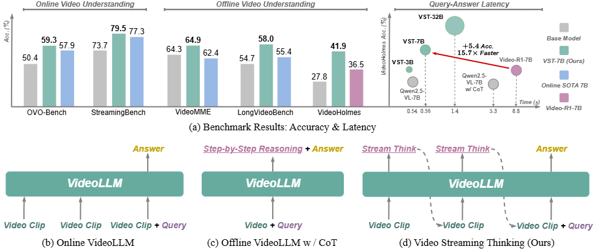
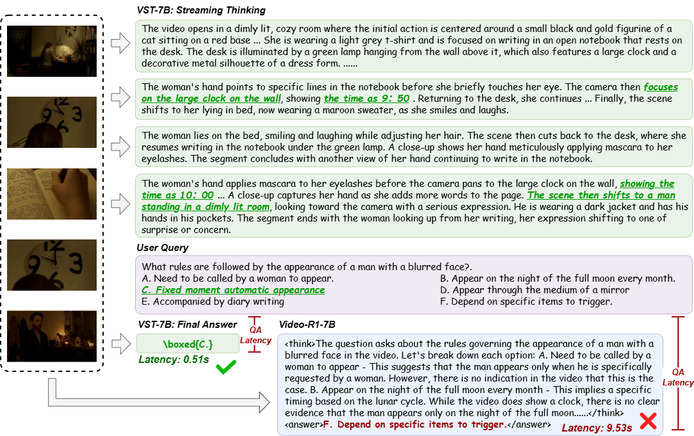

# 🎬 Video Streaming Thinking (VST)

**VideoLLMs Can Watch and Think Simultaneously**

> **Video Streaming Thinking** introduces a new paradigm for streaming video understanding that interleaves active reasoning with continuous video consumption — enabling amortized test-time scaling with real-time responsiveness.

---

## 🔍 Overview

Existing online VideoLLMs focus on efficient streaming perception but lack explicit analytical reasoning. Offline VideoLLMs with Chain-of-Thought (CoT) can reason deeply, but incur high query-answer (QA) latency that violates real-time constraints. **VST bridges this gap** by shifting the LLM backend from passive waiting to active, intermittent reasoning *during* video consumption — a **thinking-while-watching** mechanism inspired by human neural coupling.

  

### Key Idea

Instead of deferring all reasoning until a user query arrives, VST continuously processes incoming video clips and produces **intermediate streaming thoughts** in real time. This front-loads and amortizes the reasoning cost, so the final response is both **deeply grounded** and **instantly available**.

---

## ✨ Highlights

- **🧠 Streaming Thinking Paradigm** — Interleaves autoregressive textual reasoning with real-time video consumption, maintaining a dual-memory system (short-term visual buffer + long-term textual semantic memory).
- **📊 State-of-the-Art Performance** — Achieves top results on online benchmarks (StreamingBench, OVO-Bench) while remaining competitive on offline benchmarks (VideoMME, LongVideoBench, VideoHolmes).
- **⚡ Low QA Latency** — Delivers better accuracy than offline CoT methods (e.g., Video-R1) with **~17× lower** response latency (0.56s vs. 8.80s).
- **📈 Parameter Scalable** — Consistent improvements across 3B, 7B, and 32B model scales.
- **🔧 Complete Training Pipeline** — Two-stage post-training recipe combining VST-SFT and VST-RL, with an automated knowledge-graph-based data synthesis pipeline.

---

## 📐 Method

  

VST operates as a **multi-round video conversation** within a constrained context window:

1. **Video clips** arrive sequentially from the stream.
2. At each interval, the LLM generates a **streaming thought** conditioned on the current clip and accumulated memory.
3. A **first-in-first-out memory update** maintains long-term textual semantic memory.
4. Upon receiving a **user query**, the model generates the final answer grounded in both the accumulated memory and the latest visual context.

## 🗝️ Case Study

  

## 🏗️ Model Zoo

| **Model** | **OVO-Bench** | **StreamingBench** | **VideoMME** | **LongVideoBench** | **VideoHolmes** |
|---|---|---|---|---|---|
| VST-3B | 56.2 | 75.5 | 59.5 | 54.1 | 36.1 |
| VST-7B | 59.3 | 79.5 | 64.9 | 58.0 | 41.9 |
| VST-32B | 63.5 | 80.7 | 67.2 | 60.7 | 45.1 |

## 📅 TODO
- [x] Release the paper.
- [ ] Release checkpoint and eval code.
- [ ] Release training code.
- [ ] Release training data.

---
## 👍 Acknowledgement
We thank the following great works and open-source repositories:
- [StreamingVLM](https://github.com/mit-han-lab/streaming-vlm)
- [MemAgent](https://github.com/BytedTsinghua-SIA/MemAgent)
- [Streamingthinker](https://github.com/EIT-NLP/StreamingLLM)
## 📖 Citation (TBD)

