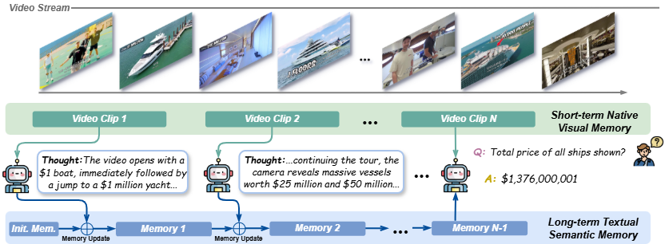

# 🎬 Video Streaming Thinking (VST)

**VideoLLMs Can Watch and Think Simultaneously**

> **Video Streaming Thinking** introduces a new paradigm for streaming video understanding that interleaves active reasoning with continuous video consumption — enabling amortized test-time scaling with real-time responsiveness.

---

## 🔍 Overview

Existing online VideoLLMs focus on efficient streaming perception but lack explicit analytical reasoning. Offline VideoLLMs with Chain-of-Thought (CoT) can reason deeply, but incur high query-answer (QA) latency that violates real-time constraints. **VST bridges this gap** by shifting the LLM backend from passive waiting to active, intermittent reasoning *during* video consumption — a **thinking-while-watching** mechanism inspired by human neural coupling.

  

### Key Idea

Instead of deferring all reasoning until a user query arrives, VST continuously processes incoming video clips and produces **intermediate streaming thoughts** in real time. This front-loads and amortizes the reasoning cost, so the final response is both **deeply grounded** and **instantly available**.

---

## ✨ Highlights

- **🧠 Streaming Thinking Paradigm** — Interleaves autoregressive textual reasoning with real-time video consumption, maintaining a dual-memory system (short-term visual buffer + long-term textual semantic memory).
- **📊 State-of-the-Art Performance** — Achieves top results on online benchmarks (StreamingBench, OVO-Bench) while remaining competitive on offline benchmarks (VideoMME, LongVideoBench, VideoHolmes).
- **⚡ Low QA Latency** — Delivers better accuracy than offline CoT methods (e.g., Video-R1) with **~17× lower** response latency (0.56s vs. 8.80s).
- **📈 Parameter Scalable** — Consistent improvements across 3B, 7B, and 32B model scales.
- **🔧 Complete Training Pipeline** — Two-stage post-training recipe combining VST-SFT and VST-RL, with an automated knowledge-graph-based data synthesis pipeline.

---

## 📐 Architecture

  

VST operates as a **multi-round video conversation** within a constrained context window:

1. **Video clips** arrive sequentially from the stream.
2. At each interval, the LLM generates a **streaming thought** conditioned on the current clip and accumulated memory.
3. A **first-in-first-out memory update** maintains long-term textual semantic memory.
4. Upon receiving a **user query**, the model generates the final answer grounded in both the accumulated memory and the latest visual context.

The joint probability decomposes as:

$$p(y \mid q, V) = p(y \mid q, c_K, m_K) \cdot \prod_{k=1}^{K-1} p(z_k \mid c_k, m_{k-1})$$

---

## 🏋️ Training Pipeline

### Stage 1: VST-SFT (Supervised Fine-Tuning)

- Formulates streaming thinking as a multi-turn sequence with interleaved video clips and textual thoughts.
- Applies a **streaming video attention mask** that restricts attention to a sliding window of the latest visual tokens while keeping all textual tokens visible.
- Trains with next-token prediction loss on streaming thoughts and the final response.

### Stage 2: VST-RL (Reinforcement Learning)

- Transitions from off-policy imitation to **on-policy self-improvement** via an agentic rollout loop.
- Uses **GRPO** (Group Relative Policy Optimization) with verifiable rewards computed solely from final answer correctness.
- Encourages the model to generate streaming thoughts that genuinely improve downstream QA accuracy.

---

## 🗂️ Data Synthesis Pipeline

Due to the scarcity of streaming video reasoning data, we develop an automated synthesis pipeline:

| **Stage** | **Description** |
|---|---|
| **Streaming Entity Extraction** | Segment videos into scene clips; incrementally extract entities and relations into a knowledge graph |
| **Evidence Chain Sampling** | Use depth-first search (DFS) to sample multi-hop evidence chains from the knowledge graph |
| **Stream-Thought QA Synthesis** | Prompt Gemini 3.0-Flash to generate temporally-ordered QA pairs with grounded streaming thoughts |
| **Quality Filtering** | Apply strict rubrics: world-knowledge check, format alignment, logical consistency, repetition check, thought validation |

This produces **100K high-quality streaming reasoning samples**, supplemented with 50K open-ended QA instances from LLaVA-Vid.

---

## 📊 Results

### Online Video Understanding

| **Model** | **StreamingBench** | **OVO-Bench** |
|---|---|---|
| GPT-4o | 73.3 | 59.5 |
| Gemini 1.5 Pro | 75.7 | 63.0 |
| StreamForest-7B | 77.3 | 55.6 |
| Streamo-7B | — | 57.9 |
| **VST-7B (Ours)** | **79.5** | **59.3** |

### Offline Video Understanding

| **Model** | **VideoMME (Long)** | **LongVideoBench** | **VideoHolmes** |
|---|---|---|---|
| Video-R1-7B | — | — | 36.5 |
| LongVILA-R1-7B | 55.2 | 58.0 | — |
| TimeChatOnline-7B | 48.4 | 55.4 | — |
| **VST-7B (Ours)** | **55.3** | **58.0** | **41.9** |

### QA Latency Comparison

| **Method** | **QA Latency** |
|---|---|
| Qwen2.5-VL-7B w/ CoT | 5.30s |
| Video-R1 w/ CoT | 8.80s |
| **VST-7B (Ours)** | **0.56s** |

---

## 🔬 Ablation Studies

- **Training data composition**: Mixing VST streaming-thought data with LLaVA-Vid QA yields +6.6% on OVO-Bench over LLaVA-Vid alone.
- **Training stages**: VST-SFT primarily boosts backward memory (+9.2%), while VST-RL enhances forward prediction (+12.7%). Combining both achieves the best overall performance.
- **Thinking times**: Backward tracing benefits from more thinking steps (up to 16), while real-time and forward tasks plateau at ~4 steps.
- **Model scaling**: Consistent gains across 3B (+7.7%), 7B (+7.8%), and 32B (+9.2%) on StreamingBench.

---

## 🏗️ Model Zoo

| **Model** | **Base Model** | **OVO-Bench** | **StreamingBench** | **VideoMME** | **LongVideoBench** | **VideoHolmes** |
|---|---|---|---|---|---|---|
| VST-3B | Qwen2.5-VL-3B | 56.2 | 75.5 | 59.5 | 54.1 | 36.1 |
| VST-7B | Qwen2.5-VL-7B | 59.3 | 79.5 | 64.9 | 58.0 | 41.9 |
| VST-32B | Qwen2.5-VL-32B | 63.5 | 80.7 | 67.2 | 60.7 | 45.1 |

---

## 📖 Citation

